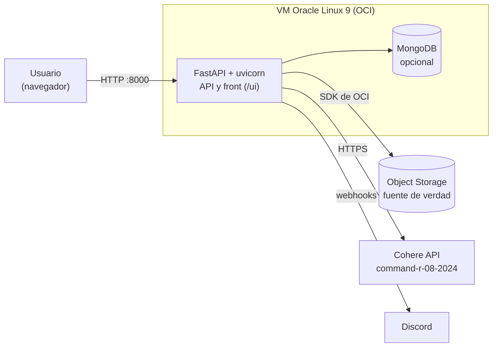
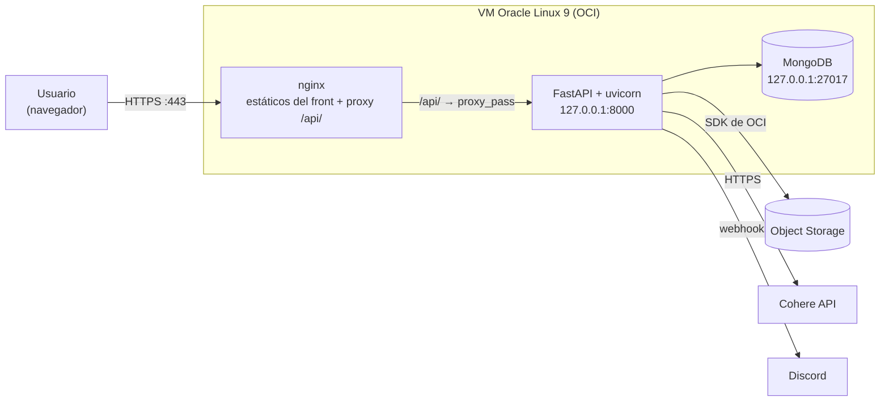
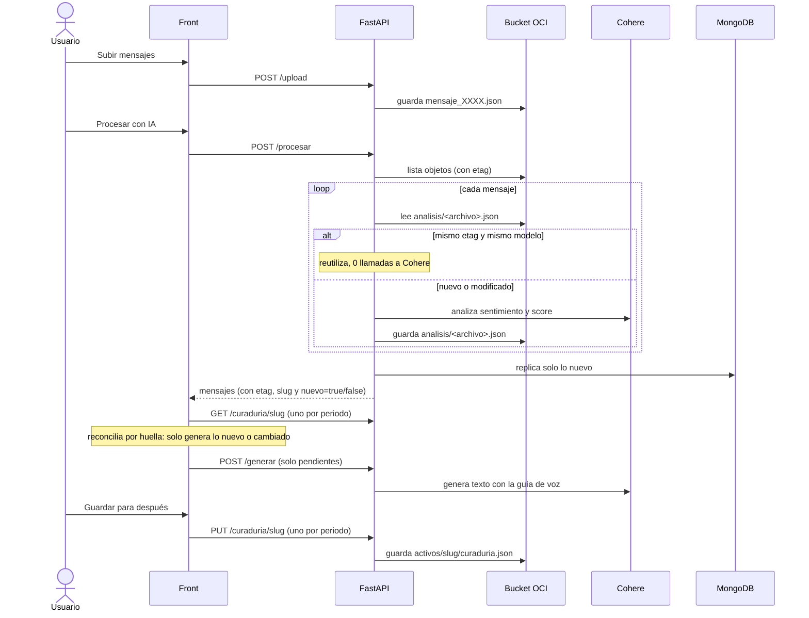
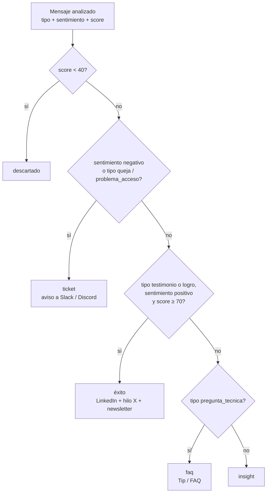

# G10-Latam-Equipo51-Power-CommunityLab

# InsightMind · Community Lab

> **Versión 1 del README.** El proyecto funciona de punta a punta, pero hay partes pendientes. Cada sección indica si describe lo que **ya existe** o lo que está **propuesto**.

InsightMind toma los mensajes de una comunidad (Discord, Slack…), los analiza con IA, decide qué hacer con cada uno y prepara el contenido para publicar:

- **Éxitos** → posts de LinkedIn, hilo de X y destaque de newsletter.
- **Preguntas técnicas** → tips / FAQ.
- **Quejas y problemas** → tickets con aviso al equipo por Slack o Discord.
- **Lo irrelevante** → se descarta.

El equipo revisa, edita y publica desde una interfaz web. La voz de marca (tono, reglas de estilo) se configura una vez y se aplica a todo lo que se genera.

---

## Contenido

1. [Estado actual](#1-estado-actual)
2. [Arquitectura](#2-arquitectura)
3. [Flujo de procesamiento y caché](#3-flujo-de-procesamiento-y-caché)
4. [Árbol de decisión (umbrales)](#4-árbol-de-decisión-umbrales)
5. [Datos: bucket de OCI y MongoDB](#5-datos-bucket-de-oci-y-mongodb)
6. [API](#6-api)
7. [Configuración (`.env`)](#7-configuración-env)
8. [Ejecución local](#8-ejecución-local)
9. [Despliegue en Oracle Linux 9 (OCI)](#9-despliegue-en-oracle-linux-9-oci)
10. [Separar front y backend con nginx](#10-separar-front-y-backend-con-nginx-propuesto)
11. [Estructura del repositorio](#11-estructura-del-repositorio)
12. [Pendientes](#12-pendientes)

---

## 1. Estado actual

| Área | Estado |
|---|---|
| Ingesta de mensajes JSON al bucket (`/upload`) | Listo |
| Análisis de sentimiento y score con Cohere, con caché | Listo |
| Árbol de decisión (descartar / ticket / éxito / FAQ / insight) | Listo |
| Generación de contenido con guía de voz (texto + chips) | Listo |
| Curaduría guardada por periodo (`activos/<slug>/curaduria.json`) | Listo |
| Réplica consultable en MongoDB (opcional) | Listo |
| Avisos de tickets  Discord | Listo |
| Despliegue en una sola máquina (FastAPI sirve API y front) | Listo |
| **Separar front y backend (front público, backend interno con nginx)** | **Pendiente: ver sección 10** |
| Autenticación de usuarios | Pendiente |
| Publicación real en LinkedIn / X | Pendiente (hoy se prepara el contenido) |

---

## 2. Arquitectura

### 2.1 Hoy (todo en un proceso)



El puerto 8000 está expuesto, el CORS está abierto (`allow_origins=["*"]`) y la API no tiene autenticación.

### 2.2 Objetivo (propuesto)

Solo nginx se publica. El backend escucha únicamente en `127.0.0.1`.



Reglas de red:

- Entra por Internet **solo 80/443** (más 22 para administración, idealmente restringido a tu IP).
- **8000** y **27017** no se abren ni en `firewalld` ni en la Security List / NSG de OCI.

---

## 3. Flujo de procesamiento y caché

El bucket es la **fuente de verdad**. MongoDB es una proyección para consultas y puede apagarse sin que el flujo se caiga.



### Qué evita el reprocesamiento

| Mecanismo | Dónde | Qué evita |
|---|---|---|
| Caché de análisis, clave `etag` + `modelo` | `analisis/<archivo>.json` | Volver a llamar a Cohere por un mensaje ya analizado |
| Huella del activo, `formato + archivo + etag` | `curaduria.json` y front | Volver a generar contenido ya generado |
| Protección de ediciones | `reconciliar()` en `app.js` | Pisar un texto editado, en cola o publicado |
| `forzar=true` en `/procesar` y `/generar` | API | Reprocesar a propósito |
| "Volver a generar" (`texto_previo`) | `/generar` | Regenera **solo ese** activo |

Notas:

- La **newsletter** resume todo el lote: cambia al entrar mensajes nuevos y se regenera.
- Un cambio en la guía de voz **no** regenera el contenido ya generado.
- Un lote puede mezclar periodos (`Semana_01`, `Semana_05`…): cada mensaje, activo y ticket se guarda bajo el slug de **su propio periodo** (`2026-semana-05`).

### Guía de voz

`PUT /config/voz` guarda `{ texto, chips }` en `config/voz.json`. Cada chip (Sin hashtags, Sin emojis, Formal, Cercano…) se traduce a una regla imperativa en el prompt. "Sin hashtags" y "Sin emojis" además se garantizan con un filtro posterior, porque el modelo podría ignorarlos.

---

## 4. Árbol de decisión (umbrales)

Cada mensaje recibe de Cohere un `sentimiento` (positivo / neutral / negativo) y un `score` de 0 a 100 (qué tan relevante o accionable es). Con eso se calcula su ruta (`calcular_ruta()` en `backend/analizador_sentimiento.py`).



| Parámetro | Valor | Dónde |
|---|---|---|
| `UMBRAL_DESCARTE` | **40** | `backend/analizador_sentimiento.py` |
| `UMBRAL_EXITO` | **70** | `backend/analizador_sentimiento.py` |
| Sentimiento → número | positivo = 0.8, neutral = 0, negativo = -0.6 | `_sent_num()` |
| Ticket por sentimiento | número ≤ -0.4 (es decir, "negativo") | `calcular_ruta()` |
| Éxito por sentimiento | número ≥ 0.6 (es decir, "positivo") | `calcular_ruta()` |
| Severidad del ticket | **Alta** si número ≤ -0.6, si no **Media** | `db.guardar_ticket()` |

Tipos válidos: `testimonio`, `logro`, `pregunta_tecnica`, `queja`, `problema_acceso`, `feedback`, `conversacion`. Si el JSON de entrada ya trae `tipo`, se respeta y Cohere solo evalúa sentimiento y score.

Qué se genera por ruta (`construir()` en `js/app.js`):

- **éxito** → un post de LinkedIn por mensaje; **hilo de X** solo para el de mayor score.
- **faq** → Tip / FAQ para los **2** de mayor score.
- **newsletter** → 1 por lote.
- **ticket** → ticket en estado `Abierto`, con aviso opcional a Slack o Discord.

Los umbrales aparecen en **Ajustes → Umbrales de decisión** y el front puede recalcular el lote. Los valores del backend están fijos en el código, así que si cambias uno, cámbialo también en el front.

---

## 5. Datos: bucket de OCI y MongoDB

### 5.1 Bucket (fuente de verdad)

```text
<BUCKET_NAME>/
├── mensaje_0001.json                  # entradas: una interacción por archivo
├── mensaje_0002.json
├── analisis/
│   └── mensaje_0001.json              # caché del análisis (etag + modelo + resultado)
├── activos/
│   └── 2026-semana-05/
│       └── curaduria.json             # activos generados/curados + tickets de ese periodo
└── config/
    └── voz.json                       # { "texto": "...", "chips": ["Sin hashtags", ...] }
```

Los prefijos `analisis/`, `activos/` y `config/` son **reservados**: `/procesar` no los trata como mensajes de entrada.

Forma de un mensaje de entrada (ver `input_examples/`):

```json
{
  "origen_comunidad": "Discord",
  "periodo_referencia": "Semana_05",
  "interaccion": {
    "autor": "Ana",
    "canal": "general",
    "tipo": "testimonio",
    "texto": "Conseguí mi primer empleo gracias al bootcamp."
  }
}
```

### 5.2 MongoDB (opcional, para consultas y un segundo front)

Sin `MONGO_URI` la app funciona solo con el bucket. Si Mongo falla, las operaciones son no-op y se pausan 60 s antes de reintentar. Nunca tumban el flujo principal.

| Colección | Contenido | Índice |
|---|---|---|
| `mensajes_entrada` | JSON de entrada tal cual baja del bucket (+ `archivo`, `etag`) | `periodo_referencia`, `origen_comunidad` |
| `analisis` | Resultado del análisis por mensaje | `slug`, `ruta` |
| `contenido_generado` | Activos (LinkedIn, X, FAQ, newsletter) | `slug`, `formato`, `estado` |
| `tickets` | Mensajes enrutados a ticket (`_id = slug:archivo`) | `slug`, `estado` |
| `lotes` | Resumen de cada procesamiento (slug, totales, caché) | — |
| `config` | Guía de voz (`_id = "voz"`) | — |

Los tickets se crean como `Abierto` solo la primera vez; un nuevo procesamiento no pisa estados ya gestionados.

`POST /sincronizar` carga a Mongo lo que ya está en el bucket (entradas, análisis, curadurías y voz). Es idempotente.

---

## 6. API

Documentación interactiva en `/docs` (Swagger) cuando el backend es accesible.

| Método | Ruta | Descripción |
|---|---|---|
| GET | `/files` | Lista los objetos del bucket |
| POST | `/upload` | Sube un archivo al bucket |
| GET | `/download/{filename}` | Descarga un objeto |
| DELETE | `/files/{filename}` | Borra un objeto |
| POST | `/procesar?forzar=false` | Analiza mensajes nuevos o modificados; devuelve cada mensaje con `etag`, `slug` y `nuevo` |
| POST | `/generar` | Genera contenido con la guía de voz; reutiliza lo ya generado por `huella` |
| GET / PUT | `/config/voz` | Lee o guarda la guía de voz (texto + chips) |
| GET | `/curaduria/{slug}` | Lee la curaduría de un periodo (404 si no existe) |
| PUT | `/curaduria/{slug}` | Guarda la curaduría de un periodo |
| POST | `/tickets/avisar` | Envía un aviso a `slack` o `discord` |
| POST | `/sincronizar` | Replica el bucket a MongoDB |

> Seguridad: `DELETE /files`, `/download` y `/sincronizar` no deberían quedar expuestos a Internet. Ver sección 10.

---

## 7. Configuración (`.env`)

Copia `.env.example` a `.env` (está en `.gitignore`; **nunca lo subas al repositorio**).

| Variable | Obligatoria | Descripción |
|---|---|---|
| `COHERE_API_KEY` | Sí | Clave de la API de Cohere |
| `BUCKET_NAME` | Sí | Nombre del bucket de OCI Object Storage |
| `MONGO_URI` | No | Cadena de conexión. Sin ella no se usa Mongo |
| `MONGO_DB` | No | Base de datos de Mongo (por defecto `insightmind`) |
| `SLACK_WEBHOOK_URL` | No | Webhook para avisos de tickets |
| `DISCORD_WEBHOOK_URL` | No | Webhook para avisos de tickets |

Credenciales de OCI: el SDK lee `~/.oci/config` (`oci.config.from_file()`) del usuario que ejecuta la app. Si cambia el usuario, cambia el archivo.

---

## 8. Ejecución local

Requisitos: **Python 3.14 o superior** (el código usa tipos como `str | None`), acceso a un bucket de OCI y una clave de Cohere.

```bash
git clone https://github.com/gbriones1234/<repo>.git
cd <repo>
python3 -m venv venv && source venv/bin/activate
pip install -r requirements.txt
cp .env.example .env        # completa COHERE_API_KEY y BUCKET_NAME
oci setup config            # si aún no tienes ~/.oci/config

uvicorn main:app --host 127.0.0.1 --port 8000
```

- Interfaz: <http://127.0.0.1:8000/ui/>
- Swagger: <http://127.0.0.1:8000/docs>

---

## 9. Despliegue en Oracle Linux 9 (OCI)

Ejemplo sobre una VM Oracle Linux 9 (sirve igual en x86_64 o ARM64 / Ampere A1), con el usuario `opc`. Estos pasos describen el despliegue **actual** (un proceso); la separación con nginx está en la sección 10.

### 9.1 Paquetes y código

```bash
sudo dnf install -y git python3.11 python3.11-pip

sudo mkdir -p /opt/insightmind && sudo chown opc:opc /opt/insightmind
git clone https://github.com/gbriones1234/<repo>.git /opt/insightmind
cd /opt/insightmind

python3.11 -m venv venv
source venv/bin/activate
pip install -r requirements.txt

cp .env.example .env && chmod 600 .env && nano .env
```

### 9.2 Credenciales de OCI

```bash
mkdir -p ~/.oci && chmod 700 ~/.oci
# copia aquí `config` y tu llave privada (.pem), o ejecuta: oci setup config
chmod 600 ~/.oci/config ~/.oci/*.pem
```

Comprueba el acceso al bucket antes de seguir:

```bash
python -c "import oci; c=oci.config.from_file(); print(oci.object_storage.ObjectStorageClient(c).get_namespace().data)"
```

### 9.3 MongoDB (opcional)

Si usas Mongo, instálalo en la misma VM y déjalo **solo en localhost**.

```bash
sudo tee /etc/yum.repos.d/mongodb-org-7.0.repo <<'EOF'
[mongodb-org-7.0]
name=MongoDB Repository
baseurl=https://repo.mongodb.org/yum/redhat/9/mongodb-org/7.0/$basearch/
gpgcheck=1
enabled=1
gpgkey=https://pgp.mongodb.com/server-7.0.asc
EOF

sudo dnf install -y mongodb-org
sudo systemctl enable --now mongod
```

Crea un usuario y activa la autenticación:

```javascript
// mongosh
use insightmind
db.createUser({ user: "insightmind", pwd: "<PASSWORD>", roles: [{ role: "readWrite", db: "insightmind" }] })
```

```yaml
# /etc/mongod.conf
net:
  bindIp: 127.0.0.1
security:
  authorization: enabled
```

```bash
sudo systemctl restart mongod
# .env
# MONGO_URI=mongodb://insightmind:<PASSWORD>@127.0.0.1:27017/insightmind
```

Luego, una sola vez, con la API arriba: `curl -X POST http://127.0.0.1:8000/sincronizar`.

### 9.4 Servicio systemd

`/etc/systemd/system/insightmind.service`:

```ini
[Unit]
Description=InsightMind API (FastAPI)
After=network-online.target
Wants=network-online.target

[Service]
User=opc
WorkingDirectory=/opt/insightmind
ExecStart=/opt/insightmind/venv/bin/uvicorn main:app --host 127.0.0.1 --port 8000
Restart=always
RestartSec=3

[Install]
WantedBy=multi-user.target
```

```bash
sudo systemctl daemon-reload
sudo systemctl enable --now insightmind
sudo systemctl status insightmind
journalctl -u insightmind -f        # logs en vivo
```

La app lee el `.env` con `python-dotenv` desde el `WorkingDirectory`, por eso la unidad no necesita `EnvironmentFile`.

### 9.5 Red

```bash
sudo firewall-cmd --permanent --add-service=http --add-service=https
sudo firewall-cmd --reload
```

En OCI (Security List o NSG de la subred/VNIC): ingreso TCP **80 y 443** desde `0.0.0.0/0`, y **22** solo desde tu IP. No abras 8000 ni 27017.

---

## 10. Separar front y backend con nginx (propuesto)

> **Esta sección es una propuesta.** La configuración de nginx no se ha probado en la VM. Valida con `nginx -t` y la lista de comprobación del final.

### 10.1 Idea

| Pieza | Quién la sirve | Visible desde Internet |
|---|---|---|
| Front (`index.html`, `css/`, `js/`) | nginx, desde `/var/www/insightmind` | Sí |
| API FastAPI | uvicorn en `127.0.0.1:8000` | **No directamente** |
| API vía proxy | nginx, bajo `/api/` | Solo las rutas permitidas |
| MongoDB | `127.0.0.1:27017` | No |

El navegador siempre necesita llegar a la API, porque el front corre en el navegador del usuario. "Backend interno" significa que **no tiene puerto público** y que **todo pasa por nginx**, que decide qué ruta se permite y quién entra (ver 10.5).

### 10.2 Cambios en el código

**1. Backend: escuchar solo en localhost** (ya está así en la unidad systemd de 9.4: `--host 127.0.0.1`).

**2. Front: llamar a la API bajo `/api`.** Hoy `js/api.js` usa `window.location.origin`. Cámbialo para que funcione tanto en local (`/ui`) como detrás de nginx (`/api`):

```javascript
// js/api.js
base: window.location.pathname.startsWith("/ui")
  ? window.location.origin                 // desarrollo: FastAPI sirve el front en /ui
  : window.location.origin + "/api",       // producción: nginx proxy en /api/
```

**3. Backend: cerrar el CORS.** Con el mismo origen (nginx) ya no hace falta `allow_origins=["*"]`. En `main.py`, reemplaza el comodín por tu dominio, o quita el middleware si el front y la API comparten origen.

**4. (Opcional) Quitar `app.mount("/ui", ...)`** al final de `main.py` cuando ya no lo necesites en desarrollo.

### 10.3 Instalar nginx y publicar el front

```bash
sudo dnf install -y nginx

sudo mkdir -p /var/www/insightmind
sudo cp -r /opt/insightmind/frontend/insightmind-v2/{index.html,css,js} /var/www/insightmind/
sudo restorecon -Rv /var/www/insightmind          # etiqueta SELinux para servir estáticos

# SELinux (enforcing por defecto en Oracle Linux): permite que nginx haga proxy a uvicorn
sudo setsebool -P httpd_can_network_connect 1
```

### 10.4 Configuración de nginx

`/etc/nginx/conf.d/insightmind.conf`:

```nginx
server {
    listen 80;
    server_name _;                      # reemplaza por tu dominio

    root  /var/www/insightmind;
    index index.html;
    client_max_body_size 20m;           # subida de mensajes

    # Front estático
    location / {
        try_files $uri $uri/ /index.html;
    }

    # Rutas del backend que NO deben salir a Internet
    location ~ ^/api/(docs|redoc|openapi\.json|sincronizar|download) {
        return 404;
    }

    # API interna, solo a través del proxy
    location /api/ {
        limit_except GET POST PUT { deny all; }     # bloquea DELETE /files

        # auth_basic           "InsightMind";                 # ver 10.5
        # auth_basic_user_file /etc/nginx/.htpasswd;

        proxy_pass         http://127.0.0.1:8000/;          # la "/" final quita el prefijo /api
        proxy_set_header   Host              $host;
        proxy_set_header   X-Real-IP         $remote_addr;
        proxy_set_header   X-Forwarded-For   $proxy_add_x_forwarded_for;
        proxy_set_header   X-Forwarded-Proto $scheme;
        proxy_read_timeout 300s;                            # /procesar y /generar llaman a Cohere
    }
}
```

```bash
sudo nginx -t
sudo systemctl enable --now nginx
sudo systemctl reload nginx
```

Para HTTPS, con un dominio apuntando a la VM: `sudo dnf install -y certbot python3-certbot-nginx && sudo certbot --nginx -d <tu-dominio>`.

### 10.5 Seguridad: lo que esta separación **no** resuelve

La API no tiene autenticación. Con nginx delante, cualquiera que llegue al front puede llamar a las rutas permitidas, incluido `/api/procesar` (que consume créditos de Cohere) y `/api/generar`. Antes de publicar a Internet, elige al menos una:

- **Basic auth en nginx** (rápido):
  ```bash
  sudo dnf install -y httpd-tools
  sudo htpasswd -c /etc/nginx/.htpasswd equipo
  # y descomenta auth_basic y auth_basic_user_file en el bloque /api/ (y en / si quieres proteger también el front)
  ```
- **Restringir por IP o VPN** en nginx (`allow` / `deny`) o directamente en la NSG de OCI.
- **Autenticación real** (OIDC / OAuth) delante de nginx, como evolución.

Además:

- Revisa qué rutas usa realmente el front y deja solo esas: `grep -nE 'fetch\(|_fetch\(' frontend/insightmind-v2/js/api.js`.
- Si el front permite borrar objetos desde la UI, ajusta `limit_except` en consecuencia.
- Rota cualquier clave que haya viajado por chat, correo o repositorio.

### 10.6 Comprobaciones

```bash
curl -I  http://<ip-o-dominio>/                  # 200: front
curl -s  http://<ip-o-dominio>/api/config/voz    # 200 (o 401 si activaste auth)
curl -I  http://<ip-o-dominio>/api/docs          # 404: bloqueado
curl -I  http://<ip-o-dominio>:8000/             # sin respuesta: puerto cerrado desde fuera
sudo ss -tlnp | grep -E ':(8000|27017)'          # deben escuchar solo en 127.0.0.1
```

---

## 11. Estructura del repositorio

```text
.
├── main.py                      # FastAPI: archivos, /procesar, tickets, curaduría; monta /ui
├── requirements.txt
├── .env.example
├── input_examples/              # mensajes JSON de ejemplo
├── backend/
│   ├── analizador_sentimiento.py  # Cohere + calcular_ruta() + umbrales
│   ├── cache_analisis.py          # caché del análisis (etag + modelo)
│   ├── generador_contenido.py     # prompts por formato + reglas de estilo
│   ├── config_voz.py              # guía de voz: texto, chips y reglas
│   ├── contexto.py                # slug por mensaje y por lote
│   ├── curaduria.py               # lee/escribe activos/<slug>/curaduria.json
│   ├── db.py                      # MongoDB (opcional, tolerante a fallos)
│   ├── oci_storage.py             # cliente único de Object Storage y prefijos
│   └── rutas_contenido.py         # /generar, /config/voz, /sincronizar
└── frontend/insightmind-v2/
    ├── index.html
    ├── css/
    ├── js/
    │   ├── api.js                 # cliente HTTP (fetch)
    │   ├── app.js                 # estado, flujo, huellas, reconciliación
    │   └── datos-ejemplo.js       # modo demo sin backend
    └── build.py                   # empaqueta el front en un solo HTML para compartir
```

---

## 12. Pendientes

- [ ] Separar front y backend con nginx (sección 10) y cerrar el CORS.
- [ ] Autenticación de usuarios (o, como mínimo, auth en nginx).
- [ ] Usar *instance principals* de OCI en lugar de `~/.oci/config` en la VM.
- [ ] Usuario de sistema dedicado para el servicio (hoy `opc`).
- [ ] Publicación real en LinkedIn / X desde la aplicación.
- [ ] Umbrales editables desde la UI y persistidos en el backend (hoy fijos en código).
- [ ] Pruebas automatizadas del flujo `/procesar` → `/generar` con OCI y Cohere simulados.
- [ ] Segundo front que consulte MongoDB.
